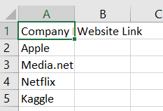
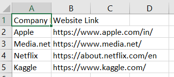

<div align="center">
  <br>
</div>

-----------------

# linkifile: Empowering Effortless Data Linking

| | |
| --- | --- |
| Package | [](https://pypi.org/project/linkifile/) [](https://pypi.org/project/linkifile/) |
| Meta | [](https://yourwebsite.com) [](https://github.com/ar8372/linkifile/blob/main/LICENSE) |

## What is linkifile?

**linkifile** is a Python package designed to automate the process of populating one column of data by web scraping information from the internet based on the contents of another column. It simplifies the task of linking data columns and enriching your datasets with desired links.

## Table of Contents

- [Main Features](#main-features)
- [Where to get it](#where-to-get-it)
- [Installation](#installation)
- [Usage](#usage)
- [Documentation](#documentation)
- [Contributing](#contributing)
- [License](#license)

## Main Features

- Effortlessly link data columns, saving time and effort in manual data enrichment tasks.
- Utilize web scraping to retrieve relevant information from the web and populate your data columns with valuable insights.
- Tailor your queries to extract specific data from the web, customizing the data enrichment process.
- Accelerate the data linking process with built-in multithreading support for faster execution, even with large datasets.
- Designed with user-friendliness in mind, making it accessible to users of all levels of technical expertise.

## Where to get it
The source code is currently hosted on GitHub at: https://github.com/ar8372/linkifile

Binary installers for the latest released version are available at the Python Package Index (PyPI).

## Installation

You can install linkifile using `pip`:

```
pip install linkifile
```
## Usage

1. Import the Linker module from the `linkifile` package.
2. Create an instance of the Linker class by specifying the source file, column pairs, and optional destination file.
3. Use the `populate` method to link data columns based on web scraping queries.

Example:

```python
from linkifile import Linker

# Create a Linker instance with source file, column pairs, and optional destination file
l = Linker(source_file="data.csv", coln_pairs=["Company Name", "Website Link"])

# Populate data columns based on a specific query
l.populate(query="{{x}} official website")
```
Before             |  After
:-------------------------:|:-------------------------:
  |  

### License

This project is licensed under the MIT License
